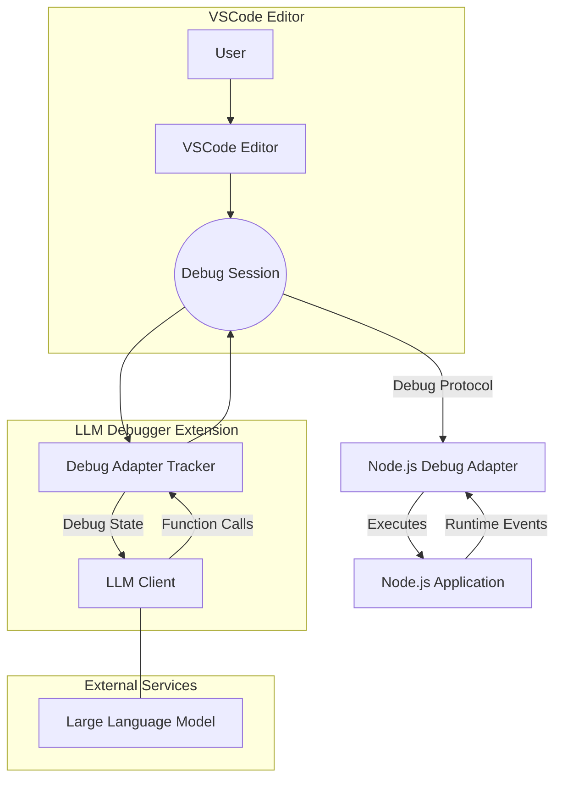

# LLM Debugger

A VSCode extension that finds bugs by *running* the code — driving the real
debugger, setting breakpoints, stepping, and reading live values — rather than
reading the source and guessing.

Each step's "what next?" is answered by [Jev](https://docs.typesafe.ai/api), a
typed System One model, for a fraction of a generation call. The generation
model is woken only for what a classifier cannot produce: the opening
hypothesis, a breakpoint location, an expression, and the final fix.

### Hunting a coupon-stacking bug

Told only `coupon percent applies before fixed => got 1450, expected 1500`, it
places its own breakpoints, steps down `coupons.js` line by line, and names the
line that computes the wrong value. 26 debugger actions, 27 fast checks, **2**
generation calls, about 17 seconds.

<video src="https://github.com/mohsen1/llm-debugger-vscode-extension/raw/main/res/video/jev-hunt.mp4" controls muted loop width="100%"></video>

[▶ Play the recording](res/video/jev-hunt.mp4) if it does not load inline.

### The original proof of concept

https://github.com/user-attachments/assets/8052f75f-bc3f-4382-97f7-b1e01936df47

This began as a **proof of concept** — a research experiment showing that an LLM
given runtime context debugs better than one given source alone. It is not a
supported product.

## Overview

Traditional LLM-based debugging approaches analyze only static source code. With LLM Debugger, the LLM is provided with real-time runtime context including:
- **Runtime Variable Values:** Observe actual variable states as the program executes.
- **Function Behavior:** Track how functions are called, what values they return, and how they interact.
- **Branch Decisions:** Understand which code paths are taken during execution.

This enriched context allows the LLM to diagnose bugs faster and more accurately. The extension also has the capability to generate synthetic data by running code and capturing execution details beyond the static source, offering unique insights into program behavior.




## What it does

- **Debugs by running, not reading.** Breakpoints, stepping, live locals, and
  expression evaluation in the paused frame — the same moves a person makes.
- **Places its own breakpoints.** It is told the failing assertion and nothing
  else; where to break and what to inspect are its decisions.
- **Refuses to guess.** A verdict that has not read a runtime value is rejected
  by the loop, so a run cannot finish by pattern-matching the error message.
- **Ends with a patch, not prose.** The verdict is a root cause plus an exact
  edit, which the benchmark applies and re-runs to decide whether it was right.
- **Keeps a cost ledger.** Every run reports its debugger actions, fast checks,
  generation calls and dollars.

## How it works

1. **Plan.** Given the failing assertion, the generation model gets one look at
   the entry file and picks its opening breakpoints. Other modules' source is
   withheld — handing over every file turns the exercise into code review.
2. **Run.** The program launches under the real debugger and runs to the first
   breakpoint.
3. **Decide.** Each pause becomes an observation — stack, locals, source around
   the line, program output, what has been tried. Jev routes the next action;
   the generation model is asked only when the action needs a location or an
   expression.
4. **Act.** Step over, in, out, continue, break somewhere else, or evaluate an
   expression. The editor highlight moves with every one.
5. **Report.** On finish, the source of the files actually visited plus the
   runtime values observed become a root cause and a minimal edit.

Deterministic code owns what neither model should: the step and wall-clock
budgets, breakpoint validation, stall detection, never continuing with nothing
bound, and the evidence requirement above.

## Using it

First, the keys:

```bash
cp api.env.example api.env   # add OPENAI_API_KEY and TYPESAFE_API_KEY (never commit it)
```

Then in any chat sidebar:

- `@debugger` — runs the open or attached file, takes its first failing check
  and hunts that.
- `@debugger the async order total comes out NaN` — hunt a symptom you name.
- `@debugger run.js` — name the program.

It does not blindly trust the open editor: candidates are run once, and the one
whose output actually reproduces the symptom wins. Pointing it at a module that
exports functions nobody calls gets you an explanation, not a silent empty run.

## Configuration

Settings → LLM Debugger:

| setting | default | what it does |
|---|---|---|
| `strategy` | `jev` | who routes each step: `jev` or `llm` (the baseline) |
| `llmProvider` | `openai` | `openai` direct, or `vercel` for the AI Gateway |
| `llmModel` | `gpt-5.4-nano` | generation model |
| `llmReasoningEffort` | `none` | `none`/`low`/`medium`/`high`; above `none` needs the direct route |
| `jevProvider` | `typesafe` | `typesafe` direct, or `vercel` |
| `jevModel` | `jev-latest` | decision model |
| `llmApiKey` / `jevApiKey` | — | falls back to `OPENAI_API_KEY` / `TYPESAFE_API_KEY` from the environment or `api.env` |

The sidebar panel in the Run and Debug view still drives the original
autonomous loop, which only runs when you arm it there.

## Installation

You can install LLM Debugger in VSCode using the "Install from VSIX" feature:

1. **Build the Extension Package:**
   - Run the following command in the project root to build the extension:
     ```bash
     npm run build
     ```

2. **Install the Extension in VSCode:**
   - Open VSCode.
   - Press `Ctrl+Shift+P` (or `Cmd+Shift+P` on macOS) to open the Command Palette.
   - Type and select **"Extensions: Install from from location..."**.
   - Browse to the directory of this repo
   - Reload VSCode if prompted.

Alternatively, if you prefer to load the extension directly from the source for development:
- Open the project folder in VSCode.
- Run the **"Debug: Start Debugging"** command to launch a new Extension Development Host.

## Jev hybrid mode

One debugging loop, two brains. The loop drives the real VSCode debugger —
breakpoints, the yellow step line, live variables — and at each step something
has to answer *what should the debugger do next?*

- **Jev** (`jev-latest`, `POST https://api.typesafe.ai/v1/systemone`) is a
  System One model, not a generative one: you post the paused state plus typed
  questions and get typed probabilistic answers back, every question evaluated
  in parallel in one request. It routes each step and says whether the evidence
  is enough yet.
- **The generation model** (`gpt-5.4-nano`, via OpenAI's `/v1/responses`) is
  woken only for what a classifier cannot produce:
  the opening hypothesis, a breakpoint location, an expression to evaluate, and
  the closing root cause and patch.
- **Deterministic code owns policy** — the step budget, the wall-clock budget,
  breakpoint validation, stall detection, never continuing with nothing bound,
  and refusing a verdict that has not read a single runtime value. Neither model
  gets a vote on those.

Either brain can be pointed at the Vercel AI Gateway instead
(`llmProvider` / `jevProvider` = `vercel`); the two routes do not speak the same
dialect and `src/ai/jev.ts` and `src/ai/llm.ts` translate.

Which brain routes is a setting (`llmDebugger.strategy`), so the same loop runs
both arms of the benchmark and only the decision-maker differs.

### Benchmark

`benchmark/` measures whether a run **actually fixed the bug**, not how fast a
model answers. Each of the 13 tasks is the example with every bug fixed except
one, so exactly one assertion fails; the agent is told only that assertion. A
run counts as solved when its proposed patch applies, makes that assertion pass,
and breaks nothing that was passing — checked by running the program.

Two full runs, 13 tasks x 2 brains each, real debugger, real stepping:

**`gpt-5.4-nano`, no reasoning — the default**

| brain | solved | median run | debugger steps | generation calls | cost |
|---|---|---|---|---|---|
| `jev` | **13/13** | **12.8s** | 147 | 67 | **$0.055** |
| `llm` | 11/13 | 92.5s | 513 | 540 | $0.243 |

**`gpt-5.6-sol`, reasoning effort `low`**

| brain | solved | median run | debugger steps | generation calls | cost |
|---|---|---|---|---|---|
| `jev` | 13/13 | 33.5s | 134 | 39 | $0.480 |
| `llm` | 12/13 | 37.7s | 82 | 120 | $1.086 |

Read across those and the routing argument makes itself twice, differently:

- **With a frontier model, Jev saves money.** `sol` plans a better next move than
  a classifier does, so it needs fewer debugger steps — but it pays for a
  generation call on every one. Same result, 2.3x the cost.
- **With a cheap model, Jev saves the task.** Left to route itself, `nano`
  flails: 513 steps and 540 generation calls to solve 11/13. Hand the routing to
  Jev and the same model solves 13/13 in 147 steps — a third of the work, and it
  stops being wrong.

The fast pairing is the interesting one: `jev` + `nano` matches `jev` + `sol`
task for task at **a ninth of the cost and under half the wall-clock**. One
honest regression — `nano` names the right file every time but lands within
three lines of the bug on 9 of 13 rather than 13 of 13. The patch is still
correct, so the solve stands; the cited line is just looser.

Per-run detail: [benchmark/results.md](benchmark/results.md) (latest) and
[benchmark/results-gpt-5.4-nano.md](benchmark/results-gpt-5.4-nano.md).

```bash
node benchmark/run.js --model=gpt-5.6-sol --effort=low   # sweep a different model
```

```bash
pnpm verify:truth          # ground truth applies and isolates correctly (no models)
pnpm bench:quick           # 3 tasks x 2 brains
pnpm bench                 # all 13 tasks -> benchmark/results.md
pnpm test:host             # debugger primitives against a real dev host
```

Results: [benchmark/results.md](benchmark/results.md) ·
Details: [docs/jev-resources.md](docs/jev-resources.md) ·
Example: [examples/order-processor/](examples/order-processor/)

---

## For AI coding assistants (Copilot / Claude / Codex)

The live debugger is exposed as eight agent-callable tools, so another agent can
hunt a bug in a visible session — red dots, yellow step line, variables, debug
toolbar, all on screen:

`llm-debugger_start`, `llm-debugger_breakpoint`, `llm-debugger_step`,
`llm-debugger_state`, `llm-debugger_evaluate`, `llm-debugger_triage_jev`,
`llm-debugger_diagnose_llm`, `llm-debugger_stop`

- **In-process (Copilot):** registered as `languageModelTools` — ask, or
  reference with `#debugStart`, `#debugEvaluate`, and so on.
  Skill prompt: [docs/AGENT_SKILL.md](docs/AGENT_SKILL.md).
- **Out-of-process (Claude Code, Codex CLI):** the same tools over MCP —
  `claude mcp add llm-debugger -- node $PWD/mcp-server/server.mjs`.
  The extension host must be running; it writes `.llm-debugger/bridge.json`
  for discovery.
