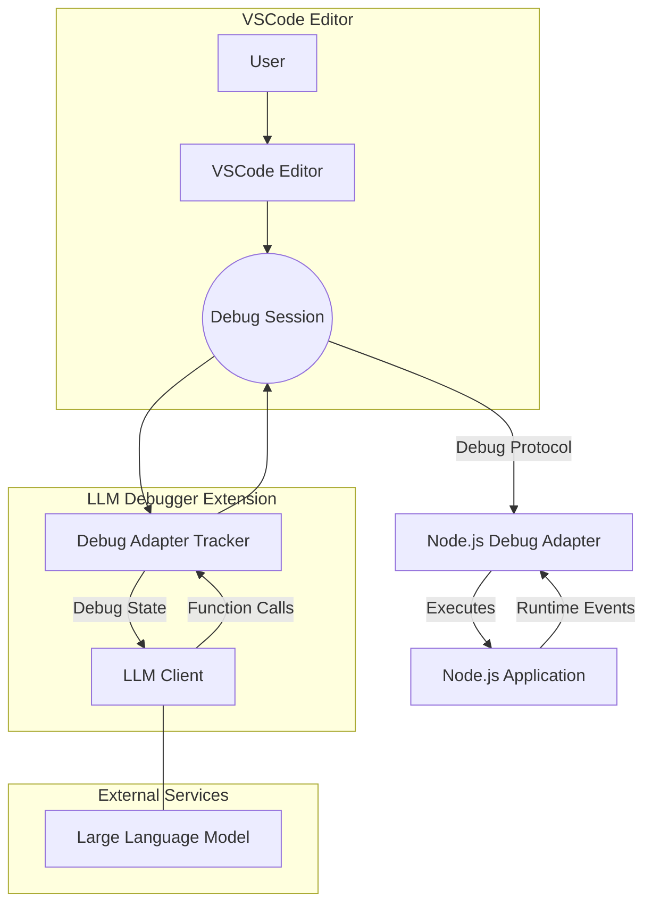

# LLM Debugger

LLM Debugger is a VSCode extension that demonstrates the use of large language models (LLMs) for active debugging of programs. This project is a **proof of concept** developed as a research experiment and will not be actively maintained or further developed.


https://github.com/user-attachments/assets/8052f75f-bc3f-4382-97f7-b1e01936df47


## Overview

Traditional LLM-based debugging approaches analyze only static source code. With LLM Debugger, the LLM is provided with real-time runtime context including:
- **Runtime Variable Values:** Observe actual variable states as the program executes.
- **Function Behavior:** Track how functions are called, what values they return, and how they interact.
- **Branch Decisions:** Understand which code paths are taken during execution.

This enriched context allows the LLM to diagnose bugs faster and more accurately. The extension also has the capability to generate synthetic data by running code and capturing execution details beyond the static source, offering unique insights into program behavior.




## Key Features

- **Active Debugging:** Integrates live debugging information (variables, stack traces, breakpoints) into the LLM’s context.
- **Automated Breakpoint Management:** Automatically sets initial breakpoints based on code analysis and LLM recommendations.
- **Runtime Inspection:** Monitors events like exceptions and thread stops, gathering detailed runtime state to guide debugging.
- **Debug Operations:** Supports common debugging actions such as stepping over (`next`), stepping into (`stepIn`), stepping out (`stepOut`), and continuing execution.
- **Synthetic Data Generation:** Captures interesting execution details to generate data that extends beyond static code analysis.
- **Integrated UI:** Features a sidebar panel within the Run and Debug view that lets you toggle AI debugging and view live LLM suggestions and results.

## Commands and Contributions

- **Start LLM Debug Session:**  
  - Command: `llm-debugger.startLLMDebug`  
  - Description: Launches an AI-assisted debugging session. Once activated, the extension configures the debugging environment for Node.js sessions and starts gathering runtime data for LLM analysis.

- **Sidebar Panel:**  
  - Location: Run and Debug view  
  - ID: `llmDebuggerPanel`  
  - Description: Displays the current state of the AI debugging session. Use the control panel to toggle "Debug with AI" mode. It shows live debugging insights, LLM function calls, and final debug results.

- **Debug Configuration Provider & Debug Adapter Tracker:**  
  - Automatically integrated with Node.js debug sessions.  
  - Injects LLM context into the session by reading the workspace state flag `llmDebuggerEnabled` and automatically setting breakpoints and handling debug events (e.g., exceptions, thread stops).
  - Supports LLM-guided commands for common operations like `next`, `stepIn`, `stepOut`, and `continue`.

## Configuration

The extension maintains a single configuration flag (`llmDebuggerEnabled`) stored in the workspace state. This flag determines whether AI-assisted debugging is enabled. You can toggle this option via the sidebar panel. No additional settings are exposed in the Settings UI.

## How It Works

1. **Session Initialization:**  
   When you launch a Node.js debug session (or use the command `llm-debugger.startLLMDebug`), the extension activates and attaches its debug adapter tracker to the session.

2. **Breakpoint Management:**  
   The extension automatically sets initial breakpoints based on an analysis of the workspace code. It then monitors runtime events to adjust breakpoints or trigger LLM actions as needed.

3. **Runtime Inspection:**  
   As the debug session progresses, the extension gathers live data including variable values, stack traces, and output (stderr/stdout). This data is sent to the LLM to determine the next debugging steps.

4. **LLM Guidance and Action Execution:**  
   The LLM processes the combined static and runtime context to suggest actions such as stepping through code or modifying breakpoints. These actions are executed automatically, streamlining the debugging process.

5. **Session Termination:**  
   When the debug session ends (either normally or due to an exception), the extension collects final runtime data and generates a summary with a code fix and explanation based on the LLM’s analysis.

## Installation

You can install LLM Debugger in VSCode using the "Install from VSIX" feature:

1. **Build the Extension Package:**
   - Run the following command in the project root to build the extension:
     ```bash
     npm run build
     ```

2. **Install the Extension in VSCode:**
   - Open VSCode.
   - Press `Ctrl+Shift+P` (or `Cmd+Shift+P` on macOS) to open the Command Palette.
   - Type and select **"Extensions: Install from from location..."**.
   - Browse to the directory of this repo
   - Reload VSCode if prompted.

Alternatively, if you prefer to load the extension directly from the source for development:
- Open the project folder in VSCode.
- Run the **"Debug: Start Debugging"** command to launch a new Extension Development Host.

## Use Cases

- **Faster Bug Resolution:**  
  The integration of runtime state with static code provides the LLM with a comprehensive view, enabling quicker identification of the root cause of issues.

- **Enhanced Debugging Workflow:**  
  Developers benefit from real-time, AI-driven insights that help navigate complex codebases and manage debugging tasks more efficiently.

- **Research & Data Generation:**  
  The tool can be used to generate synthetic runtime data for research purposes, offering new perspectives on program behavior that static analysis cannot capture.

---

LLM Debugger is an experimental project showcasing how combining live debugging data with LLM capabilities can revolutionize traditional debugging practices.

---

## Jev hybrid mode

One debugging loop, two brains. The loop drives the real VSCode debugger —
breakpoints, the yellow step line, live variables — and at each step something
has to answer *what should the debugger do next?*

- **Jev** (`jev-latest`, `POST https://api.typesafe.ai/v1/systemone`) is a
  System One model, not a generative one: you post the paused state plus typed
  questions and get typed probabilistic answers back, every question evaluated
  in parallel in one request. It routes each step and says whether the evidence
  is enough yet.
- **The generation model** (`gpt-5.6-sol` at reasoning effort `low`, via
  OpenAI's `/v1/responses`) is woken only for what a classifier cannot produce:
  the opening hypothesis, a breakpoint location, an expression to evaluate, and
  the closing root cause and patch.
- **Deterministic code owns policy** — the step budget, the wall-clock budget,
  breakpoint validation, stall detection, never continuing with nothing bound,
  and refusing a verdict that has not read a single runtime value. Neither model
  gets a vote on those.

Either brain can be pointed at the Vercel AI Gateway instead
(`llmProvider` / `jevProvider` = `vercel`); the two routes do not speak the same
dialect and `src/ai/jev.ts` and `src/ai/llm.ts` translate.

Which brain routes is a setting (`llmDebugger.strategy`), so the same loop runs
both arms of the benchmark and only the decision-maker differs.

### Using it

```bash
cp api.env.example api.env   # add OPENAI_API_KEY and TYPESAFE_API_KEY (never commit it)
```

Then in any chat sidebar:

- `@debugger` with a file open or attached — runs it, takes the first failing
  check and hunts that.
- `@debugger the async order total comes out NaN` — hunt a symptom you name.
- `@debugger run.js` — name the program.

Keys, models and route live in Settings → LLM Debugger (`llmProvider`,
`llmModel`, `llmReasoningEffort`, `jevProvider`, `jevModel`, `strategy`);
`api.env` is the fallback for the keys.

### Benchmark

`benchmark/` measures whether a run **actually fixed the bug**, not how fast a
model answers. Each of the 13 tasks is the example with every bug fixed except
one, so exactly one assertion fails; the agent is told only that assertion. A
run counts as solved when its proposed patch applies, makes that assertion pass,
and breaks nothing that was passing — checked by running the program.

Two full runs, 13 tasks x 2 brains each, real debugger, real stepping:

**`gpt-5.4-nano`, no reasoning — the default**

| brain | solved | median run | debugger steps | generation calls | cost |
|---|---|---|---|---|---|
| `jev` | **13/13** | **12.8s** | 147 | 67 | **$0.055** |
| `llm` | 11/13 | 92.5s | 513 | 540 | $0.243 |

**`gpt-5.6-sol`, reasoning effort `low`**

| brain | solved | median run | debugger steps | generation calls | cost |
|---|---|---|---|---|---|
| `jev` | 13/13 | 33.5s | 134 | 39 | $0.480 |
| `llm` | 12/13 | 37.7s | 82 | 120 | $1.086 |

Read across those and the routing argument makes itself twice, differently:

- **With a frontier model, Jev saves money.** `sol` plans a better next move than
  a classifier does, so it needs fewer debugger steps — but it pays for a
  generation call on every one. Same result, 2.3x the cost.
- **With a cheap model, Jev saves the task.** Left to route itself, `nano`
  flails: 513 steps and 540 generation calls to solve 11/13. Hand the routing to
  Jev and the same model solves 13/13 in 147 steps — a third of the work, and it
  stops being wrong.

The fast pairing is the interesting one: `jev` + `nano` matches `jev` + `sol`
task for task at **a ninth of the cost and under half the wall-clock**. One
honest regression — `nano` names the right file every time but lands within
three lines of the bug on 9 of 13 rather than 13 of 13. The patch is still
correct, so the solve stands; the cited line is just looser.

Per-run detail: [benchmark/results.md](benchmark/results.md) (latest) and
[benchmark/results-gpt-5.4-nano.md](benchmark/results-gpt-5.4-nano.md).

```bash
node benchmark/run.js --model=gpt-5.6-sol --effort=low   # sweep a different model
```

```bash
pnpm verify:truth          # ground truth applies and isolates correctly (no models)
pnpm bench:quick           # 3 tasks x 2 brains
pnpm bench                 # all 13 tasks -> benchmark/results.md
pnpm test:host             # debugger primitives against a real dev host
```

Results: [benchmark/results.md](benchmark/results.md) ·
Details: [docs/jev-resources.md](docs/jev-resources.md) ·
Example: [examples/order-processor/](examples/order-processor/)

---

## For AI coding assistants (Copilot / Claude / Codex)

The live debugger is exposed as eight agent-callable tools, so another agent can
hunt a bug in a visible session — red dots, yellow step line, variables, debug
toolbar, all on screen:

`llm-debugger_start`, `llm-debugger_breakpoint`, `llm-debugger_step`,
`llm-debugger_state`, `llm-debugger_evaluate`, `llm-debugger_triage_jev`,
`llm-debugger_diagnose_llm`, `llm-debugger_stop`

- **In-process (Copilot):** registered as `languageModelTools` — ask, or
  reference with `#debugStart`, `#debugEvaluate`, and so on.
  Skill prompt: [docs/AGENT_SKILL.md](docs/AGENT_SKILL.md).
- **Out-of-process (Claude Code, Codex CLI):** the same tools over MCP —
  `claude mcp add llm-debugger -- node $PWD/mcp-server/server.mjs`.
  The extension host must be running; it writes `.llm-debugger/bridge.json`
  for discovery.
